# Practica 1 - Modulo de Facturación

### Introduce los datos de tu empresa.
1. El primer paso sera dirigirnos a el apartado "Clientes" y dentro pinchar en "Clientes"
 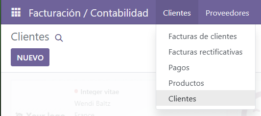

2. Creamos un nuevo Cliente
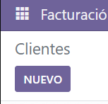

3. Introducimos los datos de la empresa y pulsamos "Añadir"
 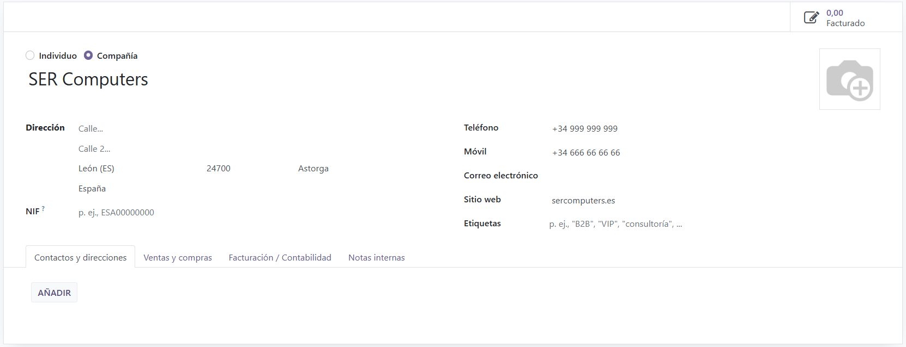

4. Creamos el contacto
 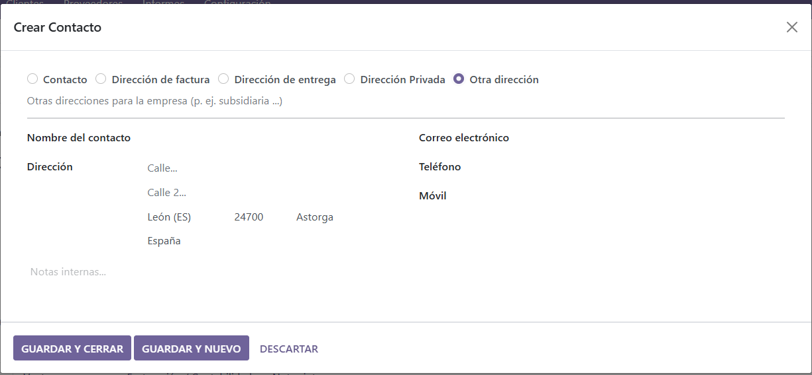

5. Aqui vemos que el cliente se ha creado con exito
 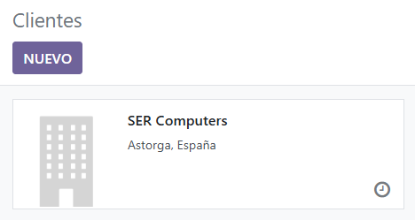

### Crea un segundo usuario que tendrá permiso únicamente para acceder al módulo de Facturación.
6. Entramos a los ajustes
 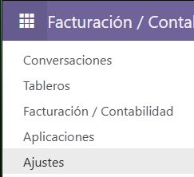

7. Y pinchamos en "Gesstionar usuarios"
 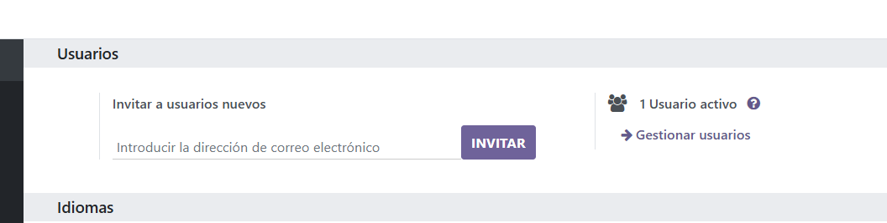

8. Creamos un nuevo usuario
 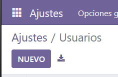

9. Escribimos el nombre, el correo, y en "Accounting" selecionamos "Facturacion" y en "Administration" seleccionamos "Permisos de acceso"
 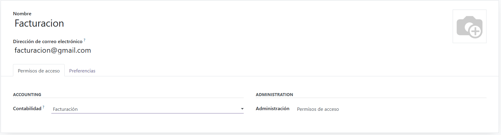

### Configura la apariencia de las facturas con las siguientes característica:
- Cambia los colores por defecto del encabezado y del botón
- Añade un logotipo de la empresa y una imagen de fondo en las facturas
- Agrega QR de pago a las facturas
10. Vamos al apartado de "Facturación" de el menu
 

11. Vamos a la configuración y a ajustes
 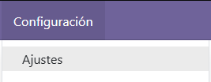

12. Accedemos a las "opciones generales"
 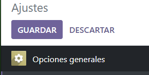

13. Aqui podemos cambiar el color del encabezado
 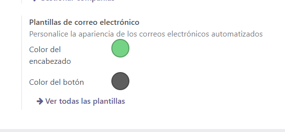

14. Y guardamos loscambios
 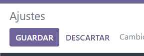

15. Dentro del menu podemos Diseñar la factura dandole a "Presonalizar"
 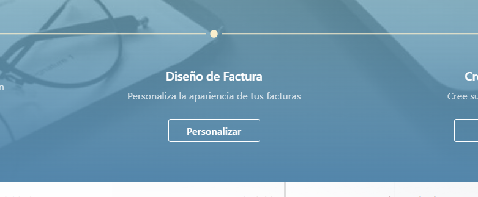

16. Elejimos los colores, logo y fondo y guardamos los cambios
 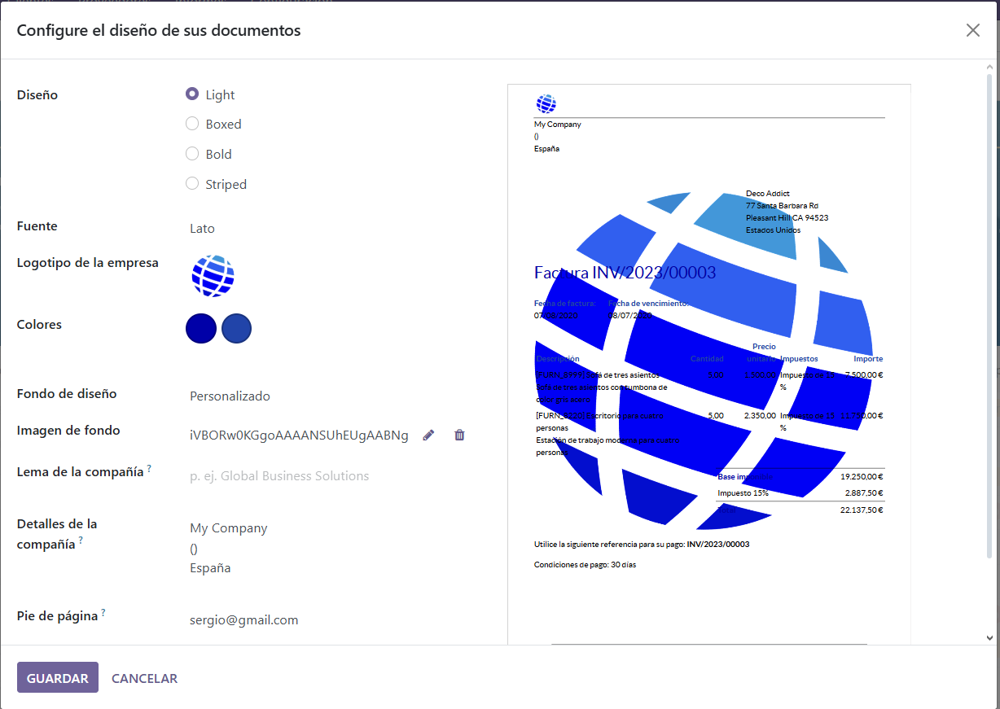

17. Dentro de la configuracion de la factura podemos activar la opcion del QR
 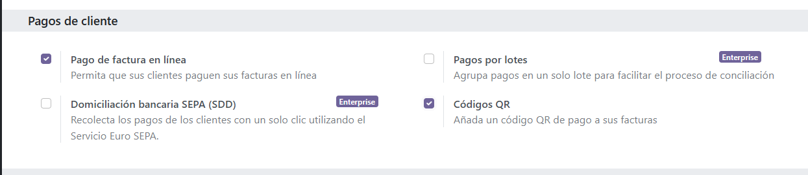

### Carga datos de los clientes. Estos datos se encuentran en el fichero clientes.csv
18. Vamos al apartado "Clientes" dentro de "Facturacion"
 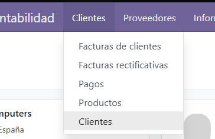

19. En el apartado de "Favoritos" vamos a "Importar registros"
 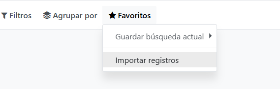

20. Subimos el archivo
 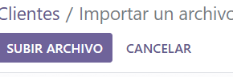

21. Configuramos las columnas del csv y Importamos el archivo
 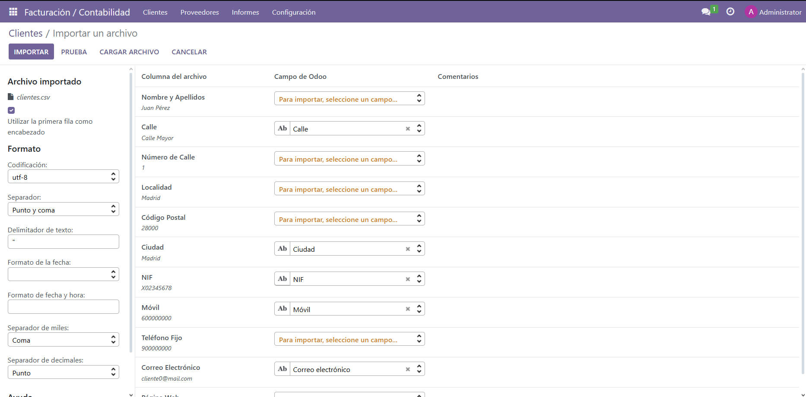

1.  Asi deberia quedra despues de importar
 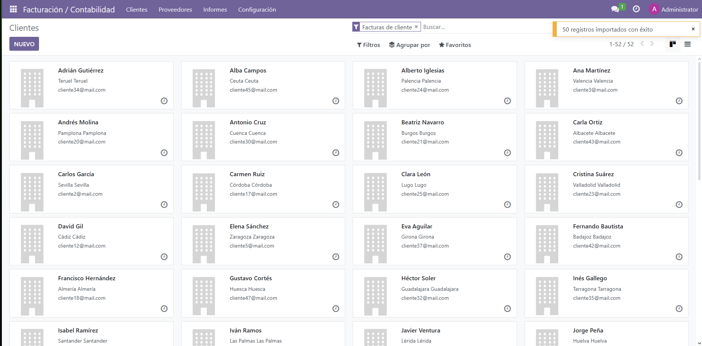

### Inicia sesión con el usuario que creaste al principio y genera una factura de venta de un producto que tú quieras.
23. Cierro sesion y entro a la cuenta que creamos antes
 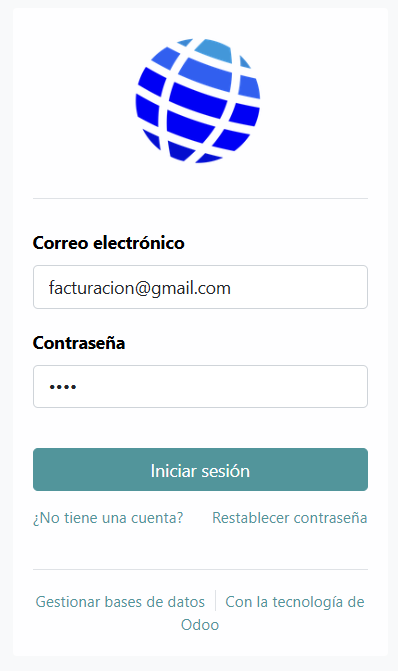

24. Pinchamos en "Crear factura"
 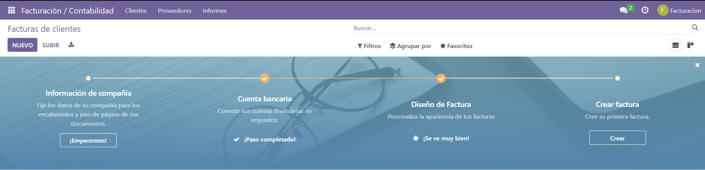

25. Configuramos la factura y elegimos para que cliente va a ser
 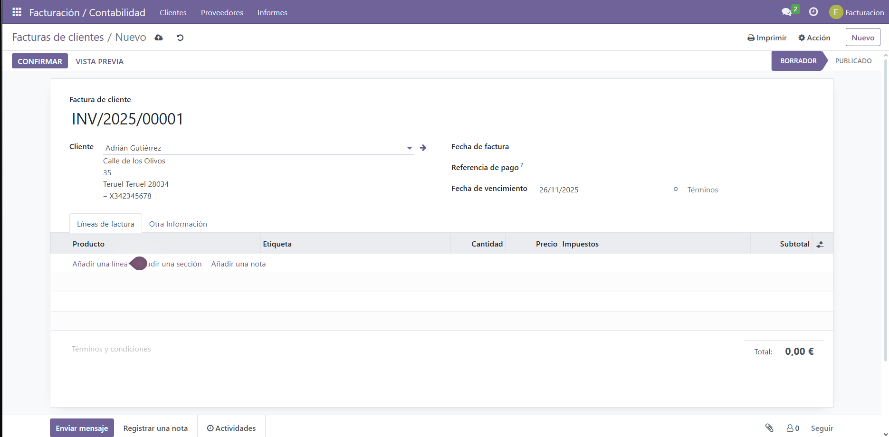

26. Y como ultimo se la enviamos
 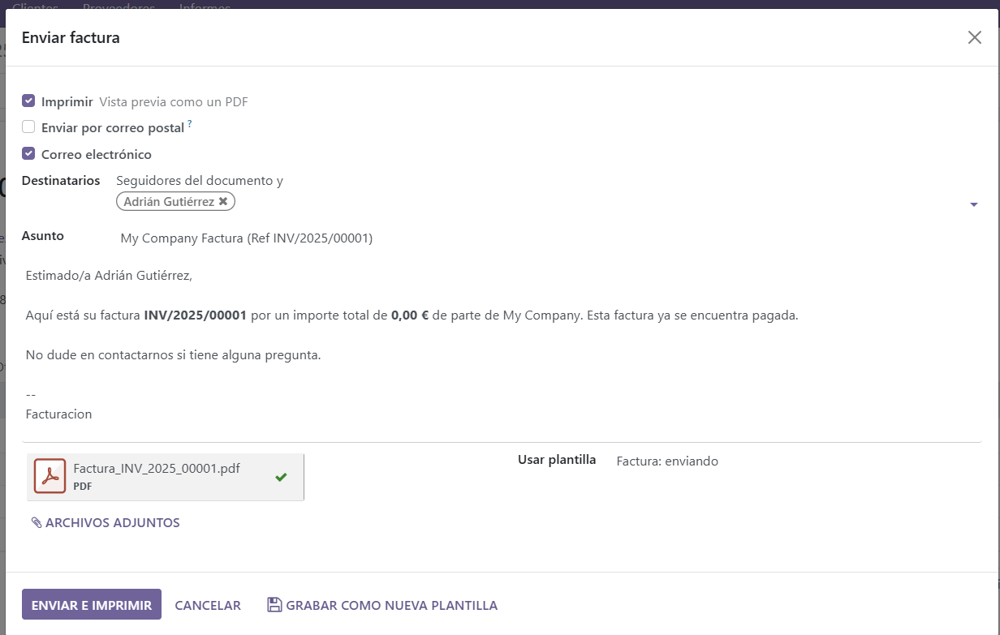
# [Factura](Factura.pdf)
